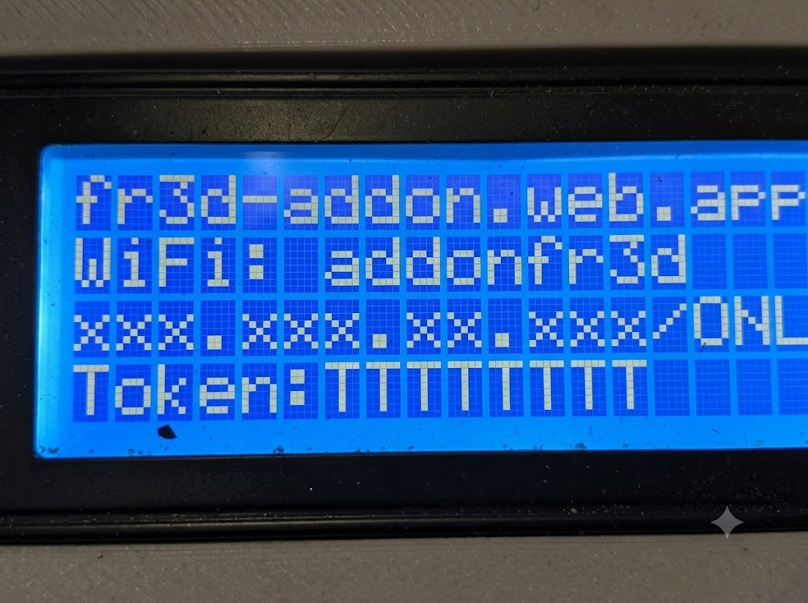

# MK3 + FR3D Addon

Public firmware for the **Desktop Filament Extruder MK3**, with **FR3D Addon** modifications by **Claudio Dadone**.

Based on **MACKEREL** (Marlin-derived filament extruder firmware by Filip Mulier / Hugh Lyman).

You can use this firmware in two ways:

1. **Standalone** — MK3S+ with FR3D Addon from the machine LCD (no Raspberry Pi gateway / web app required)
2. **Internet and/or LAN** — optional Raspberry Pi Zero 2 W **or** Windows PC gateway + the same web app, over the internet or on local WiFi (with or without internet) ([fr3d-addon.web.app](http://fr3d-addon.web.app/))

---

## What this repository contains

| Content | Description |
|---------|-------------|
| `MK3/` | Firmware sources (Arduino / Mega — flash this folder) |
| [`dist/MK3-FR3D-Addon.zip`](dist/MK3-FR3D-Addon.zip) | Ready-to-download ZIP of `MK3/` for Arduino IDE |
| [`docs/USER_GUIDE_...pdf`](docs/USER_GUIDE_FR3D_MK3_EN_ch1-2-3-4-5.pdf) | Standalone user guide (sensor, LCD, predictor operation) |
| [`docs/ayuda_fr3d_es_revision.docx`](docs/ayuda_fr3d_es_revision.docx) | Web app in-app help — Spanish review export (106 topics; live help at [fr3d-addon.web.app](https://fr3d-addon.web.app/)) |
| [`docs/diameter_sensor_infidel/`](docs/diameter_sensor_infidel/) | Printable Hall-effect (INFIDEL-style) diameter-sensor parts (STL) |
| [Pi gateway image (Release)](https://github.com/dadonec-boop/MK3-FR3D-Addon/releases/tag/pi-gateway-v0.8) | Optional Raspberry Pi Zero 2 W factory image (binary only, see Releases) |
| [Windows gateway (Release)](https://github.com/dadonec-boop/MK3-FR3D-Addon/releases/latest) | Optional Windows PC gateway package (`FR3DGateway-windows-x64.zip` — **exe binary only**) |
| Tag `v-mk3-original` | Stock MK3 (Mackerel base), **without** FR3D Addon |
| Tag `v-mk3-fr3d` / branch `main` | Latest **MK3 + FR3D Addon** |

This repository publishes **MK3 board firmware** (GPL-3.0) and, via **GitHub Releases**, **binary-only** gateway packages:

- Raspberry Pi Zero 2 W **factory SD image**
- Windows **FR3DGateway.exe** package (dedicated PC/notebook next to the extruder)

**Gateway Python source, Pi program OTA source zips, and the web app source are not published** in this repository or its Releases.

---

## What FR3D Addon adds to the firmware

Compared with original MK3, this firmware includes:

- Diameter measurement (Hall / optical) with LCD **6-point** Analog A3 calibration (1.50…2.00 mm)
- Diameter **predictor** with **Auto On / Off** (automatic E/T apply vs suggest-only); **Optimizar** sets P* by acting on E+T while puller stays in Auto
- Predictor parameter menus (basic + Advanced)
- Host serial temperature setpoint (`T` / `RTFP`) capped dynamically at **max(190 °C, predictor Tmax + 5)**, with heater safety headroom (see CHANGELOG)
- Compact USB host commands and CSV telemetry (on-demand `CSVQ`; internal fusion 2 s)
- Extended EEPROM layout for FR3D settings (current schema **V32**)

See [CHANGELOG.md](CHANGELOG.md) for the full list of changes versus original MK3.

---

## Standalone user guide

For MK3S+ with FR3D Addon operating from the machine LCD (**standalone** — without Raspberry Pi gateway / web app):

- [USER_GUIDE_FR3D_MK3_EN_ch1-2-3-4-5.pdf](docs/USER_GUIDE_FR3D_MK3_EN_ch1-2-3-4-5.pdf)
- [USER_GUIDE_FR3D_MK3_EN_ch1-2-3-4-5.docx](docs/USER_GUIDE_FR3D_MK3_EN_ch1-2-3-4-5.docx) (editable Word)

Covers project scope, Addon FR3D overview, diameter hardware (Hall-effect INFIDEL-style or ARTME 3D optical), **6-point** Analog A3 calibration on the LCD (1.50…2.00 mm), main-screen use, and recommended steps for automatic predictor operation.

Printable Hall parts: [`docs/diameter_sensor_infidel/`](docs/diameter_sensor_infidel/).

---

## Download ZIP (Arduino IDE)

If you only want to flash the board, download the ready-made package:

- **[MK3-FR3D-Addon.zip](dist/MK3-FR3D-Addon.zip)**

### Steps on your PC

1. Download [`dist/MK3-FR3D-Addon.zip`](dist/MK3-FR3D-Addon.zip).
2. Unzip it. You will get a folder named **`MK3`** (it must stay named `MK3`, matching `MK3.ino`).
3. Install **Arduino IDE** (or a compatible AVR Mega 2560 / RAMPS toolchain as used by MK3).
4. In Arduino IDE: **File → Open…** and open `MK3/MK3.ino`.
5. Select the correct **board** and **port**.
6. Click **Upload**.

After a first flash on an older EEPROM, the board may load hardcoded defaults (`Hardcoded Default Settings Loaded` on serial) or migrate known FR3D EEPROM versions to **V32** (a previous 3-point Hall calibration is reset; recapture six points).

### Alternative (from source tree)

Clone or browse this repository and open `MK3/MK3.ino` directly — same result as using the ZIP.

---

## Internet and/or LAN control (MK3s + FR3D Addon)

This is an **optional** path. Standalone LCD operation above does **not** require a Pi or the web app.

This firmware is **prepared** for remote and local control when used with the **MK3s + FR3D Addon** product stack:

- A **Raspberry Pi Zero 2 W** (or a Windows PC) acts as a gateway between the MK3 (USB/serial) and the network
- The **same web app** can run over the **internet** or on the **local LAN / WiFi**, with or without an internet connection
- Operational reference: [http://fr3d-addon.web.app/](http://fr3d-addon.web.app/) (cloud) or `http://<Pi-IP>/` on the same WiFi (LAN)

The web app / host stack is an **additional product feature** and is **not** published here as open-source.

A **prebuilt SD image** for the Pi Zero 2 W gateway is available for download under [Releases](https://github.com/dadonec-boop/MK3-FR3D-Addon/releases) (image file only).

---

## Download Raspberry Pi Zero 2 W gateway image

Download the factory image from the Release:

- **[fr3daddon-v0.8-small.img.zst](https://github.com/dadonec-boop/MK3-FR3D-Addon/releases/download/pi-gateway-v0.8/fr3daddon-v0.8-small.img.zst)**  
  Release notes: [pi-gateway-v0.8](https://github.com/dadonec-boop/MK3-FR3D-Addon/releases/tag/pi-gateway-v0.8)

After first boot, update the gateway program with CONSOLE `PI UPDATE GATEWAY latest` (currently **2.4.15**). That does **not** replace the SD image.

### Flash with Raspberry Pi Imager

1. Download [Raspberry Pi Imager](https://www.raspberrypi.com/software/).
2. Insert a micro SD card (**32 GB** or larger recommended).
3. Open Imager → **Choose OS** → **Use custom** → select `fr3daddon-v0.8-small.img.zst`.
4. **Choose storage** → your SD card → **Write**.
5. Insert the SD into the Pi Zero 2 W and power on.

### First boot / factory defaults

- WiFi hotspot: **SSID `addonfr3d`** / password **`addonfr3d`**
- On the MK3S+ LCD open **Control → gateway FR3D**. That screen shows the web app URL, WiFi SSID, the gateway **IP** (with online status), and the pairing **Token**:

  

- Local setup page (from a device on the same WiFi / hotspot): **`http://<IP_from_LCD>:8080/`**  
  Use the IP shown on line 3 of the LCD (before `/ONL` or `/OFF`).  
  Login: **`addonfr3d` / `addonfr3d`**
- On first boot the image personalizes hostname / SSH keys automatically (no manual script needed).
- Then continue pairing from the web app ([fr3d-addon.web.app](http://fr3d-addon.web.app/)) using the **Token** from the same LCD screen.

---

## License

- **Firmware in this repository (`MK3/`):** [GPL-3.0](LICENSE)
  - Upstream Mackerel/Marlin base remains free software under the GNU GPL
  - FR3D Addon modifications are distributed under the same GPL-3.0 terms

- **Internet control stack (web app + gateway source):**  
  **not** included in this repository and **not** licensed here as public open-source software.

- **Pi Zero 2 W factory image (Release asset):** distributed as a binary image for end users; gateway source code is not published in this repository.

---

## Links

- Firmware ZIP (Arduino IDE): [dist/MK3-FR3D-Addon.zip](dist/MK3-FR3D-Addon.zip)
- Standalone user guide (PDF): [docs/USER_GUIDE_FR3D_MK3_EN_ch1-2-3-4-5.pdf](docs/USER_GUIDE_FR3D_MK3_EN_ch1-2-3-4-5.pdf)
- Pi gateway image: [fr3daddon-v0.8-small.img.zst](https://github.com/dadonec-boop/MK3-FR3D-Addon/releases/download/pi-gateway-v0.8/fr3daddon-v0.8-small.img.zst)
- Gateway program (Pi OTA + Windows): [latest Release](https://github.com/dadonec-boop/MK3-FR3D-Addon/releases/latest)
- System / web app reference: [http://fr3d-addon.web.app/](http://fr3d-addon.web.app/)
- Source: [github.com/dadonec-boop/MK3-FR3D-Addon](https://github.com/dadonec-boop/MK3-FR3D-Addon)
